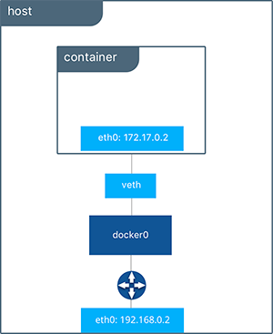
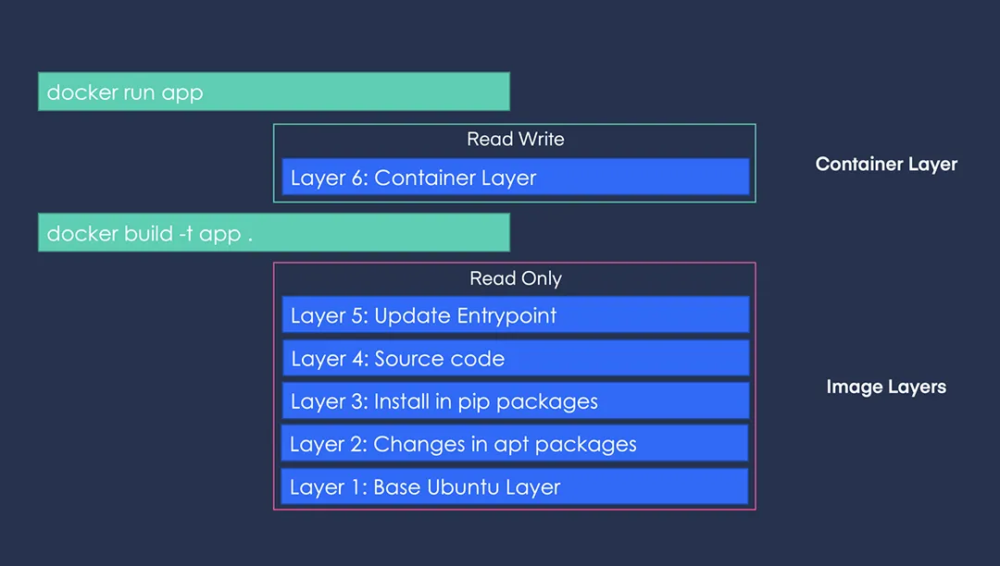
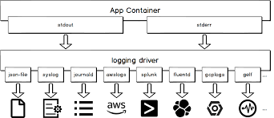
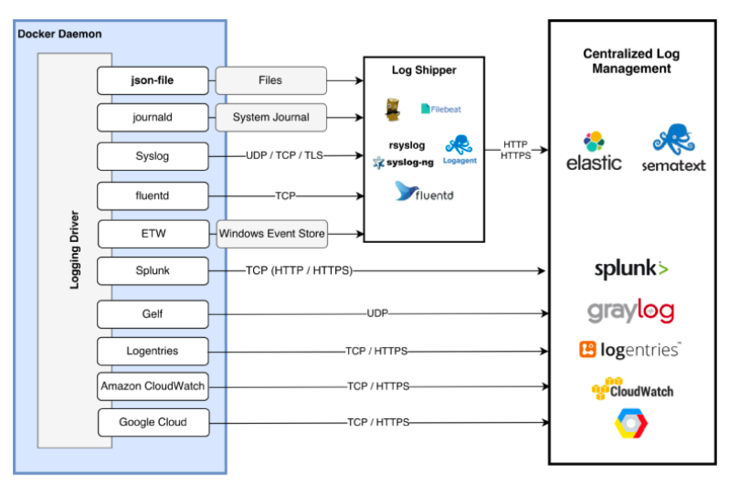
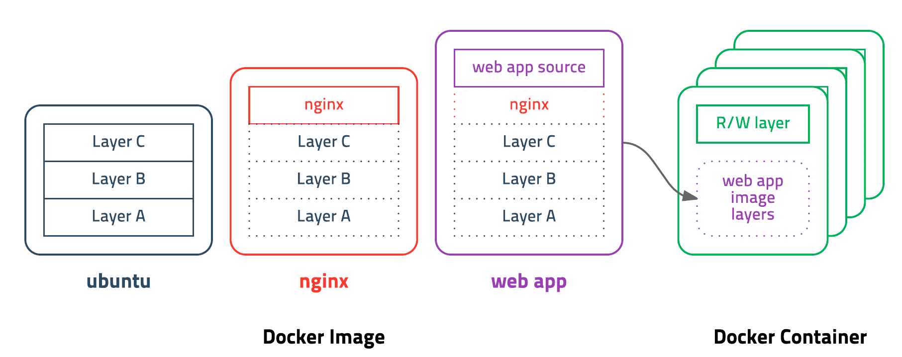

# Part1. Docker 기초

# 01. Docker 기초 파트 개요

컨테이너 기술의 발전 - 어떻게 서비스를 효율적으로 운영할 것인가?

비용 효율성, 컴퓨팅 자원의 최적화와 효과적

- Traditional Deployment - 하드웨어
- Virtualized Deployment - 가상화 도구, 낮은 성능 효율성, 자원 오버헤드 발생
- Container Deployment - 컨테이너 엔진, 격리 기술 적용, 높은 성능 효율성, 높은 자원 효율성
- K8S Deployment - 컨테이터 오케스트레이션 시스템

## kustomize 소개

- 쿠버네티스 매니페스트 파일 관리 도구

## minikube 소개

가상환경을 사용하여 쿠버네티스 클러스터를 구현, 드라이버를 선택하여 원하는 도커, 버츄얼박스 등 가상환경에서 구성이 가능하다.

```bash
minikube start --driver docker
```

- minikube 설정 확인

```bash
cat ~/.kube/config
```

- node 정보 확인

```bash
kubectl get nodes
```

- 클러스터 정보 확인

```bash
kubectl cluster-info
```

- minikube 기본 사용법
    - 쿠버네티스 클러스터 상태 확인

        ```bash
        minikube status
        ```

    - 쿠버네티스 클러스터 중지

        ```bash
        minikube stop
        ```

    - 쿠버네티스 클러스터 삭제

        ```bash
        minikube delete
        ```

    - 쿠버네티스 클러스터 일시 정지

        ```bash
        minikube pause
        ```

    - 쿠버네티스 클러스터 재시작

        ```bash
        minikube unpause
        ```

    - 추가 기능 확장 리스트

        ```bash
        minikube addons list
        ```

    - 클러스터 접속

        ```bash
        minikube ssh
        ```

    - kubectl 명령어 실행

        ```bash
        minikube kubectl
        ```

---

# 02. 도커를 이용한 컨테이너 관리

## 01. 도커 이미지와 컨테이너

- 이미지와 컨터이너는 도커 기본 단위
    - 이미지
        - 컨테이너 생성 필요 요소
        - 바이너리와 의존성 설치됨
        - 읽기 전용
    - 컨테이너
        - 호스트와 다른 컨테이너로부터 격리된 시스템 자원과 네트워크를 사용하는 프로세스
- 도커 이미지 이름 구성
    - 저장소 이름
    - 이미지 이름
    - 이미지 태그 - 생략시 lastest 최신 버전으로 인식
    - [저장소 이름]/[이미지 이름]/[이미지 태그]
- 도커 이미지 저장소
    - 도커 이미지 관리 및 공유 서버 어플리케이션

## 02. 도커 컨테이너 다루기: 컨테이너 라이프 사이클

- 컨테이너 라이프 사이클


- 컨테이너 시작

  create, run 명령오 모두 이미지가 없는 경우 자동으로 이미지를 pull 하여 실행

    - 컨테이너 생성 / 시작 / 생성 및 시작
        - docker create [image]
        - docker start [container]
        - docker run [image]
- 주요 옵션
    - -i : 호스트의 표준 입력을 컨테이너와 연결 interactive
    - -t : TTY 할당
    - -it 로 함께 주로 사용됨 : ctrl + p + q 로 실행하면서 나오기
    - -d : 백그라운드 실행
    - —rm : 컨테이너 실행 종료 후 자동 삭제
    - —name : 컨테이너 이름 지정
    - -p 80:8000 : 호스트 - 컨테이너 간 포트 바인딩
    - -v /opt/example:/example \ : 호스트 - 컨테이너 간 볼륨 바인딩

- 컨테이너 일시 중지 및 재개
    - 컨테이너 일시 중지

        ```bash
        docker pause [container]
        ```

    - 컨테이너 재개

        ```bash
        docker unpause [container]
        ```

- 컨테이너 종료
    - 컨테이너 종료 SIGTERM 시그널 전달

        ```bash
        docker stop [container]
        ```

    - 모든 컨테이너 종료

        ```bash
        docker stop $(docker ps -a -q)
        ```

    - 컨테이너 강제 종료 SIGKILL 시그널 전달

## 03. 도커 컨테이너 다루기: 엔트리포인트와 커맨드

- 엔트리포인트
    - 도커 컨테이너가 실행할 때 고정적으로 실행되는 스크립트, 명령어
    - 생략시 지정된 명령어 수행
- 커맨드
    - 도커 컨테이너가 실행할 때 수행할 명령오 혹은 엔트리포인트에 지정된 명령어에 대한 인자 값

실제 수행되는 컨테이너 명령어 [Entrypoint] [Command]

Entrypoint 가 프리픽스로 지정되어 있음

- Dockerfile 의 엔트리포인트와 커맨드
    - ENTRYPOINT [”docker-entrypoint.sh”]
    - CMD [”node”]
    - 인 경우 실제 명령어는 아래와 같다

        ```bash
        [docker-entrypoint.sh](http://docker-entrypoint.sh) node
        ```


- 도커 명령어의 엔트리포인트와 커맨드

    ```bash
    docker run --entrypoint sh ubuntu:focal
    docker run --entrypoint echo ubuntu:focal hello world 
    ```

도커 컨테이너 실행시에 엔트리포인트와 커맨드 모두 변경이 가능하다

## 04. 도커 컨테이너 다루기: 환경 변수

- -e run 옵션을 사용하여 환경변수 주입
- 파일로 환경 변수 주입
    - docker run -it —env-file ./환경변수파일.env

## 05. 도커 컨테이너 다루기: 명령어 실행

```bash
docker exec [container] [command]
```

- 실행 중인 컨테이너에 접속 가능

    ```bash
    docker exec -it my-nginx bash
    ```

- 환경 변수 확인하기

    ```bash
    docker exec my-nginx env
    ```

## 06. 도커 컨테이너 다루기: 네트워크

veth : vertual eth

- docker 0: 도커 엔진에 의해 기본 생성되는 브릿지 네트워크 ⇒ veth 와 eth 간 다리 역할



- 컨테이너 포트를 호스트의 ip:post 와 연결하여 서비스 노출

```bash
docker run -p [Host IP:PORT]:[Container port] [container]

docker run -d -p 80:80 nginx
# nginx 컨테이터의 80번 포트를 호스트 모든 IP의 80번와 연결하여 실행

docker run -d -p 127.0.0.1:80:80 nginx
# ip 지정 

docker run -d -p 80 nginx
# 컨테이너의 80번 포트를 호스트의 사용 가능한 포트와 연결 후 실행 
```

- expose 옵션은 문서화 용도로 사용
- publish 옵션은 실제 포트를 바인딩

### [도커 네트워크 드라이버](https://docs.docker.com/network/drivers/)

- 네트워크 목록 확인

    ```bash
    docker network ls
    ```

- Native Drivers
    - Bridge
    - Host
    - None
    - Overlay
- Remote Drivers
    - 3rd-party Plugins
- Single Host Networking
    - bridge : docker0(default) or user defined

        ```bash
        docker network create --driver=bridge sangjs
        # 커스텀 브릿지 생성 
        docker run -d --network=sangjs --net-alias=hello nginx
        docker run -d --network=sangjs --net-alias=grafana grafana/grafana
        ```

    - host

        ```bash
        docker run -d --network=host grafana/grafana
        ```

    - none
        - 네트워크가 필요 없는 경우 사용
        - 커스텀 네트워크에 연결하는 경우 사용

        ```bash
        docker run -it --net none ubuntu:focal
        ```

- Multi Host Networking
    - overlay: 컨테이너들을 연결시키는 가상 네트워크, 여러 클러스터에서 실행 시키는데 사용되는 네트워크 (docker swarm, kubernetes)

## [07. 도커 컨테이너 다루기: 볼륨](https://towardsdatascience.com/docker-storage-598e385f4efe)

도커 레이어 아키텍처



- 컨테이너 레이어는 컨테이너 종료시 삭제되므로 임시 저장소로 사용
- 영구적으로 저장할 방법
    - 호스트 볼륨
        - 호스트의 디렉토리를 컨테이너의 특정 경로에 마운트
        - /opt/html 디렉터리를 nginx 웹 루트 디렉토리로 마운트

        ```bash
        docker run -d --name nginx -v $(pwd)/html:/usr/share/nginx/html nginx
        ```

    - 볼륨 컨테이너
        - 특정 컨테이너의 볼륨 마운트를 공유

        ```bash
        docker run -d --name web-volume -it -v $(pwd)/html:/usr/share/nginx/html ubuntu:focal
        
        # my-volume 컨테이너의 볼륨을 공유
        docker run -d --name nginx --volumes-from web-volume -p 80:80 nginx
        docker run -d --name nginx2 --volumes-from web-volume -p 8080:80 nginx
        ```

    - 도커 볼륨
        - 도커가 제공하는 볼륨 관리 기능을 활용하여 데이터 보존
        - 기본적으로 /var/lib/dockers/volumes/$(volume-name)/_data 에 데이터 저장

        ```bash
        docker volume create --name db
        
        # 도커의 web-volume 볼륨을 nginx 웹 루트 디렉터리에 마운트 
        docker run -d --name my-mysql -e MYSQL_DATABASE=my-db -e MYSQL_ROOT_PASSWORD=1234 -v db:/var/lib/mysql -p 3306:3306 mysql
        ```

    - 일기 전용 볼륨 연결
        - 볼륨 연결 설정에 :ro 옵션을 통해 읽기 전용 마운트 옵션을 설정할 수 있음

        ```bash
        docker run -d --name nginx -v web-volume:/usr/share/nginx/html:ro nginx
        ```

## 08. 도커 컨테이너 다루기: 로그

### STDOUT / STDERR



```bash
# 전체 로그 확인 
docker logs [container]

# 마지막 로그 10 줄 확인 
docker logs --tail 10 [container]

# 실시간 로그 스트림 확인 
docker logs -f [container]

# 로그마다 타임스탬프 표시 
docker logs -f -t [containter]
```

### 호스트 운영체제의 로그 저장 경로

```bash
cat /var/lib/docker/containers/${CONTAINER_ID}/${CONTAINER_ID}-json.log
```

### 로그 용량 제한하기

- 컨테이너 단위로 로그 용량 제한을 할 수 있지만 도커 엔진에서 기본 설정을 진행할 수도 있다
- 운영 환경에서 필수 설정 필요

```bash 
# 한 로그 파일 당 최대 크기를 3MB로 제한하고, 최대 로그 파일 3개로 로테이팅 
docker run -d --log-driver=json-file --log-opt max-size=3m --log-opt max-file=5 nginx
```

### 도커 로그 드라이버



## 09. 도커 이미지 다루기 - 이미지 빌드

### 도커 이미지 구조



### 도커 파일 없이 이미지 생성

- 기존 컨테이너를 기반으로 새 이미지 생성

```bash
# docker commit [options] continter [repository[:tag]]

docker commit -a my-campus -m "first commit" ubuntu my_ubuntu:v1
```

### 도커 파일 이용하여 이미지 생성

- -t : 빌드의 태그 생성
- -f : 도커 파일의 경로 설정

```bash
docker build -t my-app:v1 ./
```

### 빌드 컨텍스트

도커 빌드 명령 수행시 현재 디렉터리를 빌드 컨텍스트라고 한다. 도커 파일로부터 이미지 빌드에 필요한 정보를 도커 데몬에게 전달하기 위한 목적이다.

### .dockerignore

.gitignore 와 동일한 문법을 가지고 있다

특정 디렉토리나 파일을 빌드 컨텍스트에서 제외하기 위한 목적이다.

## 10. 도커 이미지 다루기 - dockerfile

### [도커 파일 공식 홈페이지](https://docs.docker.com/engine/reference/builder/)

Environment variables are supported by the following list of instructions in the`Dockerfile`:

- `ADD`
- `COPY`
- `ENV`
- `EXPOSE`
- `FROM`
- `LABEL`
- `STOPSIGNAL`
- `USER`
- `VOLUME`
- `WORKDIR`
- `ONBUILD`

### 도커 빌드

```bash
docker build --force-rm -t [도커 이미지]
docker run -d [도커 이미지]
```

## 11. 도커 이미지 다루기 - 이미지 압축파일로 저장 및 불러오기

### 이미지 압축 파일로 저장

- 이미지를 tar 압축파일로 저장

```bash
docker save -o ubuntu_focal.tar ubuntu:focal
```

### 이미지 압축에서 불러오기

- 이미지를 tar 압축파일로부터 불러옵니다

```bash
docker load -i ubuntu_focal.tar
```

## 12. 도커 이미지 다루기 - 도커 허브 저장소 이용

```bash
docker tag local-image:tagname new-repo:tagname
docker push new-repo:tagname
```