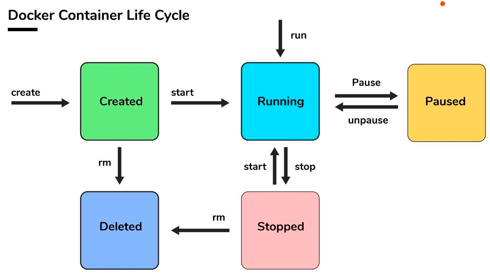
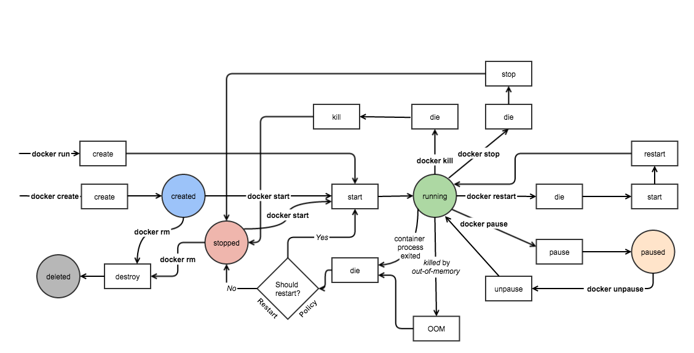

# Part1. Docker 기초

## 01. Docker 기초 파트 개요

컨테이너 기술의 발전 - 어떻게 서비스를 효율적으로 운영할 것인가?

비용 효율성, 컴퓨팅 자원의 최적화와 효과적

- Traditional Deployment - 하드웨어
- Virtualized Deployment - 가상화 도구, 낮은 성능 효율성, 자원 오버헤드 발생
- Container Deployment - 컨테이너 엔진, 격리 기술 적용, 높은 성능 효율성, 높은 자원 효율성
- K8S Deployment - 컨테이터 오케스트레이션 시스템

### kustomize 소개

- 쿠버네티스 매니페스트 파일 관리 도구

### minikube 소개

가상환경을 사용하여 쿠버네티스 클러스터를 구현, 드라이버를 선택하여 원하는 도커, 버츄얼박스 등 가상환경에서 구성이 가능하다.

```bash
minikube start --driver docker
```

- minikube 설정 확인

```bash
cat ~/.kube/config
```

- node 정보 확인

```bash
kubectl get nodes
```

- 클러스터 정보 확인

```bash
kubectl cluster-info
```

- minikube 기본 사용법
    - 쿠버네티스 클러스터 상태 확인

        ```bash
        minikube status
        ```

    - 쿠버네티스 클러스터 중지

        ```bash
        minikube stop
        ```

    - 쿠버네티스 클러스터 삭제

        ```bash
        minikube delete
        ```

    - 쿠버네티스 클러스터 일시 정지

        ```bash
        minikube pause
        ```

    - 쿠버네티스 클러스터 재시작

        ```bash
        minikube unpause
        ```

    - 추가 기능 확장 리스트

        ```bash
        minikube addons list
        ```

    - 클러스터 접속

        ```bash
        minikube ssh
        ```

    - kubectl 명령어 실행

        ```bash
        minikube kubectl
        ```


---

## 02. 도커를 이용한 컨테이너 관리

### 01. 도커 이미지와 컨테이너

- 이미지와 컨터이너는 도커 기본 단위
    - 이미지
        - 컨테이너 생성 필요 요소
        - 바이너리와 의존성 설치됨
        - 읽기 전용
    - 컨테이너
        - 호스트와 다른 컨테이너로부터 격리된 시스템 자원과 네트워크를 사용하는 프로세스
- 도커 이미지 이름 구성
    - 저장소 이름
    - 이미지 이름
    - 이미지 태그 - 생략시 lastest 최신 버전으로 인식
    - [저장소 이름]/[이미지 이름]/[이미지 태그]
- 도커 이미지 저장소
    - 도커 이미지 관리 및 공유 서버 어플리케이션

### 02. 도커 컨테이너 다루기: 컨테이너 라이프 사이클

- 컨테이너 라이프 사이클




- 컨테이너 시작

  create, run 명령오 모두 이미지가 없는 경우 자동으로 이미지를 pull 하여 실행

    - 컨테이너 생성 / 시작 / 생성 및 시작
        - docker create [image]
        - docker start [container]
        - docker run [image]
- 주요 옵션
    - -i : 호스트의 표준 입력을 컨테이너와 연결 interactive
    - -t : TTY 할당
    - -it 로 함께 주로 사용됨 : ctrl + p + q 로 실행하면서 나오기
    - -d : 백그라운드 실행
    - —rm : 컨테이너 실행 종료 후 자동 삭제
    - —name : 컨테이너 이름 지정
    - -p 80:8000 : 호스트 - 컨테이너 간 포트 바인딩
    - -v /opt/example:/example \ : 호스트 - 컨테이너 간 볼륨 바인딩

- 컨테이너 일시 중지 및 재개
    - 컨테이너 일시 중지
        - docker pause [container]
    - 컨테이너 재개
        - docker unpause [container]
- 컨테이너 종료
    - 컨테이너 종료 SIGTERM 시그널 전달
        - docker stop [container]
    - 모든 컨테이너 종료
        - docker stop $(docker ps -a -q)
    - 컨테이너 강제 종료 SIGKILL 시그널 전달
        - docker kill [container]

### 03. 엔트리포인트와 커맨드

Dockerfile 엔트리포인트와 커맨드

도커 명령어 엔트리포인트와 커맨드